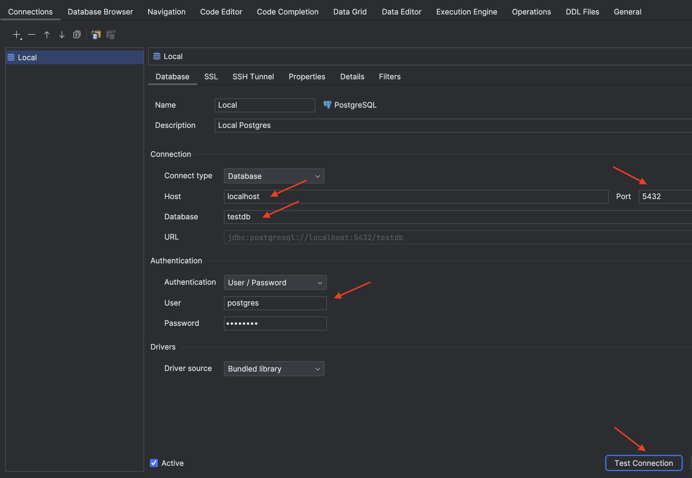
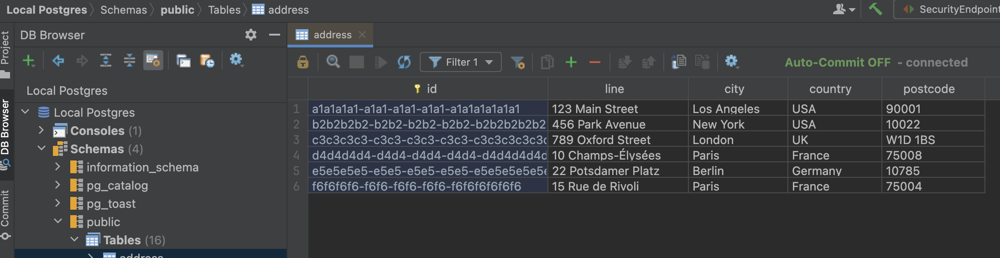

# Iced Latte QA
Automated tests in Python for project Iced Latte -> https://github.com/Sunagatov/Iced-Latte/

## Instruction
For running tests should be created configs.py in root directory of format:
```Python
HOST = '<URL:port to app Online-Store>'
HOST_DB = '<URL to database of service>'
PORT_DB = '<port to database of service>'
DB_NAME = '<name database>'
DB_USER = '<username for connect to database>'
DB_PASS = '<password for connect to database>'
DEFAULT_PASSWORD = '<default password for test users>'
JWT_SECRET = '<default secret for JWT>'
```
## Start Local Iced-Latte Backend

```sh
./start_be.sh
```

or

```sh
./start_be.sh [tag]
# for example
./start_be.sh development-bf1ba24
```

> Notes: 
> * optional parameter is a tag from the Docker Hub for [BE image](https://hub.docker.com/r/zufarexplainedit/iced-latte-backend/tags), default is the latest tag
> * it might be necessary to make script executable before the first run `chmod +x ./start_be.sh`
> * the script will pull the specified version of BE image and start BE, Postgres and Minio
> * if the tag on DockerHub is different from the latest commit on BE `development` branch, the script will print warning
> * periodically clean up the system by running [`docker rm`](https://docs.docker.com/engine/reference/commandline/container_rm/)

Swagger will be available here [http://localhost:8083/api/docs/swagger-ui/index.html](http://localhost:8083/api/docs/swagger-ui/index.html).

To check the logs use:

```sh
docker-compose -f docker-compose.local.yml logs --tail 500
```

## Report
(!) BE SURE TO INSTALL ALLURE -> https://allurereport.org/docs/gettingstarted/installation/

To get the Allure report on the local computer, follow these steps in root directory:
```bash
python -m pytest ./tests --alluredir=allure_report --clean-alluredir
allure serve allure_report
```

## Pre-commit hooks
For running pre-commit hooks should be installed pre-commit -> https://pre-commit.com/#install
```bash
pre-commit install
```

## Database Navigator

> For Ultimate Edition consider using [Database Tools and SQL plugin](https://www.jetbrains.com/help/idea/relational-databases.html)

Install Database Navigator Plugin:

1. double click **Shift**
2. type **Plugins**
3. type **Database Navigator** > click **Install**
4. navigate to **View** > **Tool Windows** > **DB Browser**
5. click New Connection 
6. select PostgesSQL

Go to **View** > **Tool Windows** > **DB Browser**.

Add new PostgresSQL connection:
 * Host `127.0.0.1`
 * Database `testdb`
 * User `postgres`
 * Password `postgres`



Enjoy!


